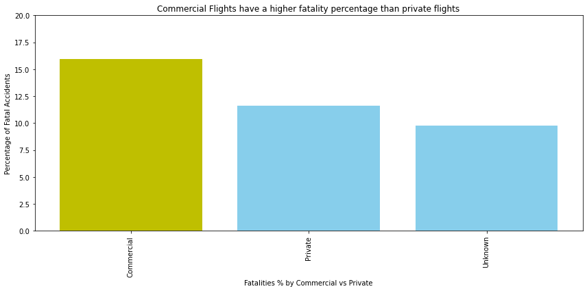

# Risk Analysis For JellyBean Airlines

Navigation through our repo is as follows

JellyBean_Airlines.ipynb

   Our jupyter notebook in which we applied our filters for data analysis and resulting plots. 
   Includes findings and recommendations

JellyBean_presentation.pptx

   Powerpoint Presentation for this project

Data Folder

   Contains the following data used for analysis 

   Aviation_data.csv
   Aviation_data_Cleaned.csv

Plots Folder

   Folder containing plots
   
   Level 1.png
   Level 2.png
   Level 2 A.png 
   Level 3.png
   

.gitignore

README.md

# BLUF

Investing in a BEECH or AERO made plane can reduce fatalitys up to 86%

Focusing more on Private Flights reduces risk of fatality by 27%

Servicing the contiguous US reduces risk of fatality by as much as 53%
compared to flying to US territories

# Business Problems

JellyBean Airlines is at a crossroads. The problem they face is what airplanes are the safest to invest in? 

That said, we decided to base our recommendations primarily on Fatality Rate.

# Data Filtering and Cleaning

We were provided the Avaition_data.csv dataset by our project manager and
upon inital exploration, The team realized the data had come from the NTSB
and most definnitions were provided on their website. We also learned that
the data was incomplete for years prior to 1993 so that was filtered immediatley.
However out data is limited by several other factors. There is little to no
data on international flights and we dont have any data on successful flights.
Our reccomendation will have to based on Domestic Flights. 

# Visualizations

From here, the team split up to focus on each of the the following visualizations

First Danny looked at the rates of fatalities in Commercial vs Private Flights illustrated below

here we can see a clear trent towards Private Flights having a much lower fatality percentage

Travis took our analysis a step further by looking at safer Private Flights by Make

we have a bit clearer of a picture starting to form but what if we include the weather as variable?

now we can see that some makes are much more reliable than others even in bad weather

Sam then asked maybe some regions in the US would be safe to avoid?

Yes indeed! Stay over dry land!! 

# Takeaways
We have concluded that JellyBean Airlines should invest in planes made by BEECH or AERO

# Future Steps

We would like a more complete dataset to expand our analysis to flights that did not have any incidents or accidents.
While we are comfortable with our analysis, it is limited in that we have no metrics for total flights or international.
We would like to run another analysis for JellyBean Airlines usung more complete data.

# Sources and Links

